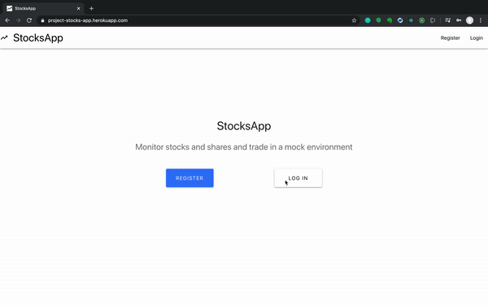
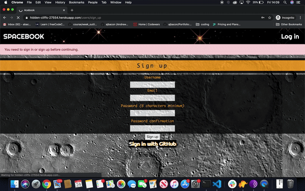

<h1 align="center"> Andrew Bacon </h1>

 

 
 [Skills](#tech-skills) | [Projects](#projects) | [Education](#education) | [Experience](#experience) | [Other Interests](#other-interests)
 

I’m a software engineer having recently completed the intensive Makers Academy software engineering course. My background is in aerospace engineering, where I have proudly led teams in delivering complex satellite and aircraft structures. In transitioning to software engineering, I want to continue my passion of solving complex problems and working with cutting edge technologies but also open up the vast array of exciting opportunities available in digital tech.

My software experience has focused around building full-stack applications using JavaScript/Node, Python and Ruby, however the skills and practices I’ve developed through Makers has left me confident and keen to tackle any technology. I’m now seeking opportunities to work in a collaborative, fast-paced environment where I can rapidly progress and gain experience building innovative and scalable web applications

## Tech Skills:

- Ruby, Ruby on Rails, RSpec and Sinatra
- JavaScript, ReactJS, NodeJS, Express, JQuery, Jasmine and Jest
- PostgreSQL, ActiveRecord, MongoDB and Mongoose
- HTML and css

## Other Strengths

**Methodical Problem Solver:** Throughout my career I have logically structured problems and translated requirements into functional products, which is the core of any engineering discipline. Solving new, complex and interesting problems in digital tech is what excites me about being a software engineer.

**Experienced in Leadership:** As a senior systems engineer I had overall responsibility for ensuring products meet the technical specifications of the clients, usually with a team of 3-5 engineers. As such I'm able to effectively own tasks and deliver often in very time pressured situations.

**Accomplished Communicator:** A large part of being an engineer is being able to clearly communicate often complex technical concepts. The positions I've held have often required me to be the technical point of contact with clients, where effective communication was necessary to not only build relationships, but also to maintain the reputation of my company. 

## Projects

| Project             | Information         |
| :--------------:    |:----------------    |
| <h4>[N.E.O.N](https://github.com/even13/game_of_life) </h4> 
 | <h4>Description</h4><ul><li>An alternative take on Conways Game of Life simulation, adding 2-player functionality, completed over 10 days, with agile at the core of team processes</li><li>This was my first React Project and provided a fantastic experience in learning to manage complex component and state structure in a React application</li><li>The experience gained from this project will help in better planning React component structures, thus reducing time spent refactoring. Additionally, with such complex state management in the app, Redux would have helped reduce complexity</li></ul><b>Technologies: </b>JavaScript, NodeJS, ReactJS, Jest, Enzyme <b>Code Quality & Deployment: </b>Travis CI, Heroku, ESLint, Code Climate|
| <h4>[Stocks App](https://github.com/ajbacon/StocksApp) </h4> 
 | <h4>Description</h4> <ul><li>Post-Makers Personal Project to develop a full-stack JavaScript application, tracking stock markets and the general business world</li><li>The purpose is to gain a deeper understanding in building my own API, but also hit external API end points and learn modern React principles (with React hooks and redux)</li><li>The focus will be well thought-out, thoroughly tested code. Currently hosted on Heroku and CI/CD with Travis CI, this will be updated to AWS in due course</li></ul> <b>Technologies: </b>JavaScript, Express, MongoDB, NodeJS, ReactJS, Redux, Jest, Enzyme, Supertest <b>Code Quality & Deployment: </b>Travis CI, Heroku, ESLint, Prettier, Code Climate|
| <h4>[SpaceBook](https://github.com/ajbacon/acebook-true-GrIT)</h4> 
 | <h4>Description</h4> <ul><li>A full-stack clone of Facebook, built with a Ruby, Rails and PostgreSQL backend completed over 10 days, again, with agile at the core of team processes</li><li>This project was extremely helpful in establishing deeper understanding of fundamentals such as the MVC pattern, RESTful routes and managing database interactions through an ORM</li><li>My core responsibilities on the project were to setup authentication and create database relations in ActiveRecord for managing posts, friend requests, friends etc</li></ul> <b>Technologies: </b>Ruby, Rails, ActiveRecord (postgreSQL), RSpec, Capybara <b>Code Quality & Deployment: </b>Travis CI, Heroku, Rubocop, Code Climate|
 | <h4>[Bank Tech Test](https://github.com/ajbacon/bank_tech_test_rb)</h4> | <h4>Description</h4> <ul><li>REPL application mock tech test, practicing solid OO design and TDD principles</li></ul><b>Technologies: </b>Ruby, RSpec, OOD <b>Code Quality: </b>Rubocop|

## Education

#### Makers Academy (11/19 to 02/20)
Intensive Web Development Bootcamp

- Strong focus on well tested, readable and scalable code
- OOP, TDD, MVC, DDD
- Agile/XP
- Ruby, Rails, JavaScript
- RSpec, Jasmine

#### University of Manchester (09/2003 to 09/2007)

- Aerospace Engineering
- Grade: MEng(hons) 2:1

#### A-Levels (Lady Manner School, Bakewell)

- Maths (A), Physics(A), Chemistry (B)

## Experience

**BAE Systems** (Nov 2018 to Nov 2019)  
_Specialist Composites Structures Consultant_

- Consultant engineer brought in as a specialist in composite structures for the Type 26 Frigate programme

**Surrey Satellite Technology Limited (Part of Airbus Group)** (Mar 2013 to May 2014 & Aug 2015 to Nov 2018)  
_Senior Mechanical Systems Engineer_

- Managed a team of engineers responsibile for ensuring structural qualification against Launch and in-orbit loading of the [Quantum](http://www.esa.int/Applications/Telecommunications_Integrated_Applications/Quantum) satellite
- By far the largest and most complex satellite SSTL have designed/manufactured
- Managed the relationship between SSTL and the customer structural experts
- Presented technical justifications at design acceptance reviews

**Atkins WS** (Oct 2007 to Mar 2013)  
_Graduate Engineer to Senior Engineer_

- Structural Engineer specialising in strength analysis of aircraft wings
- Key role in the design and certification of Airbus A380, A350 and A400M wings
';
## Other Interests

A county level tennis player when I was younger, I like to keep active! Football, tennis, golf, cricket, skiing, squash to name a few of the sports I like to play regularly.

Additionally, I love reading articles and blogs on engineering/tech related stuff, cooking, a good board game and before Makers I got slightly addicted to CodeWars!
 
 

